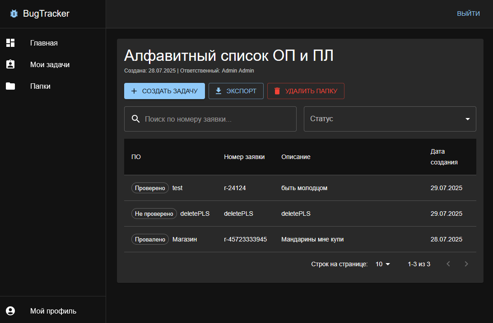

# Bug Tracker

Веб-приложение для управления задачами и отслеживания багов, разработанное в рамках производственной практики. Проект построен на Go с применением принципов чистой архитектуры.





---

## Ключевые возможности

*   **Аутентификация и авторизация** пользователей через Keycloak (OAuth2/OIDC).
*   **Разделение ролей:** Администратор и Пользователь.
*   **Управление проектами (папками) и задачами** с поддержкой CRUD-операций.
*   Назначение задач конкретным исполнителям.
*   Автоматические **email-уведомления** о новых задачах.
*   Генерация и экспорт отчетов по задачам в формате **Excel**.
*   **Пагинация и поиск** по задачам и пользователям.
*   Светлая и темная тема интерфейса.

---

## Технологический стек

*   **Backend:** Go, Chi (роутер), GORM (ORM), PostgreSQL, Redis (сессии).
*   **Frontend:** Vite, React, Material-UI.
*   **Инфраструктура:** Docker, Docker Compose, Keycloak, Caddy (reverse proxy с HTTPS).

---

## Быстрый старт (локальная разработка)

Это руководство поможет вам запустить проект на вашем компьютере для разработки и тестирования.

### Шаг 1: Предварительная настройка (делается один раз)

**1. Настройка локальных доменов**

Для корректной работы аутентификации через Keycloak необходимо, чтобы домены `myapp.local` и `keycloak.local` вели на ваш компьютер.

Откройте файл `hosts` с правами администратора:
*   **Windows:** `C:\Windows\System2\drivers\etc\hosts`
*   **Linux/macOS:** `/etc/hosts`

И добавьте в конец файла следующую строку:
```
127.0.0.1 myapp.local keycloak.local
```

**2. Установка корневого сертификата**

Caddy автоматически сгенерирует HTTPS-сертификаты. Чтобы ваш браузер им доверял, нужно **один раз** установить корневой сертификат Caddy в вашу систему.

1.  Сначала запустите `docker-compose up -d caddy`. Это создаст необходимые файлы.
2.  Найдите в папке проекта файл по пути:
    `caddy/data/pki/authorities/local/root.crt`
3.  **Установите этот `root.crt` файл** в хранилище **"Доверенные корневые центры сертификации"** вашей операционной системы.
    *   **Windows:** Дважды кликните по файлу, выберите "Установить сертификат" -> "Локальный компьютер" -> "Поместить все сертификаты в следующее хранилище" -> "Обзор" -> "Доверенные корневые центры сертификации".
    *   **Linux (Ubuntu):** `sudo cp caddy/data/pki/authorities/local/root.crt /usr/local/share/ca-certificates/` и затем `sudo update-ca-certificates`.
    *   **macOS:** `sudo security add-trusted-cert -d -r trustRoot -k /Library/Keychains/System.keychain caddy/data/pki/authorities/local/root.crt`.
4.  **Важно:** После установки сертификата **полностью перезапустите ваш браузер**.

### Шаг 2: Запуск и настройка

1.  **Настройте переменные окружения.** Скопируйте файл с примером:
    ```bash
    cp .env.example .env
    ```


2.  **Запустите все сервисы** с помощью Docker Compose:
    ```bash
    docker-compose up -d --build
    ```


3.  **Получите Client Secret из Keycloak:**
    1.  Откройте админ-панель Keycloak в браузере: **https://keycloak.local**
    2.  Войдите, используя `KC_ADMIN_USERNAME` и `KC_ADMIN_PASSWORD` из вашего `.env` файла.
    3.  В меню слева выберите `Clients`.
    4.  Нажмите на клиента с ID `your-app`.
    5.  Перейдите на вкладку `Credentials`.
    6.  В поле `Client secret` вы увидите замаскированный секрет. Нажмите кнопку `Regenerate` справа от него.
    7. Keycloak покажет вам новый секрет. Скопируйте его.

4.  **Добавьте Client Secret в `.env`:**
    1.  Откройте ваш файл `.env`.
    2.  Вставьте скопированный секрет в переменную `KEYCLOAK_CLIENT_SECRET=`.
    3.  Сохраните файл.

5.  **Перезапустите проект:**
    ```bash
    docker-compose up -d --build
    ```
    Теперь бэкенд-сервис запустится успешно, так как у него есть все необходимые данные.

### Готово!

*   Ваше приложение будет доступно по адресу: **https://myapp.local**
*   Админ-панель Keycloak: **https://keycloak.local**
